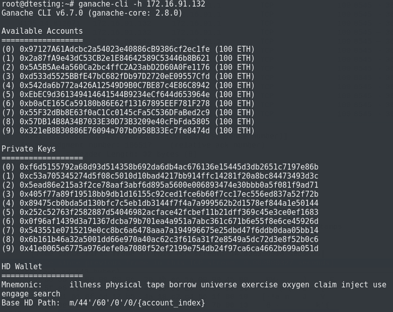
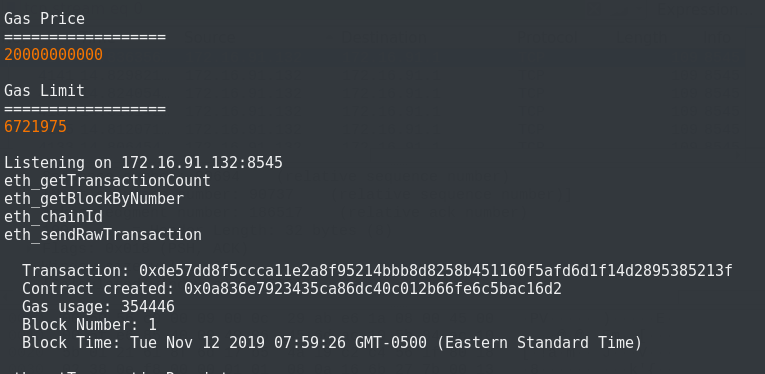
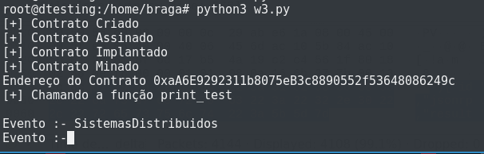
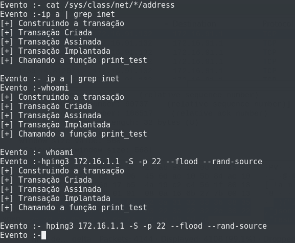
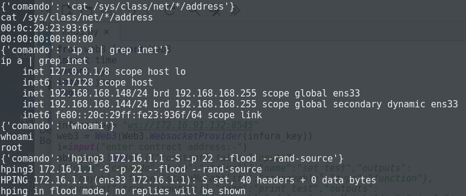
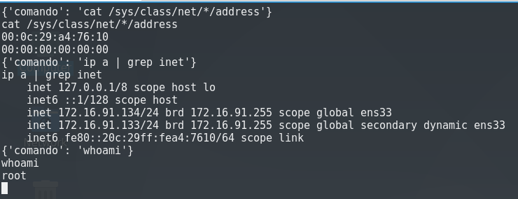

Implementação de simulada de C2 em Ethereum Smart Contracts para o artigo da disciplina de Sistemas Distribuidos -- Uniceub 01/2019

1.  Iniciando o Ganache CLI na máquina BotMaster, para simular o funcionamento real do *Ethereum* e criar  nossa *blockchain* privada:

1.  Iniciando o primeiro script em Python no BotMaster:

1.  Enviando comandos pelos eventos:

1.  Comandos sendo executados no alvo A:

1.  Comandos sendo executados no alvo B:

1.  Inspecionando tráfego de rede do BotMaster com Wireshark

